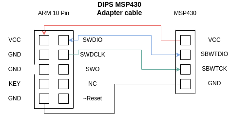
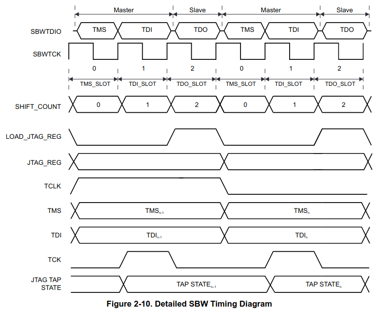
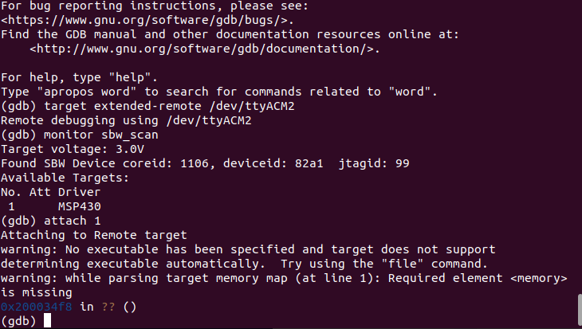
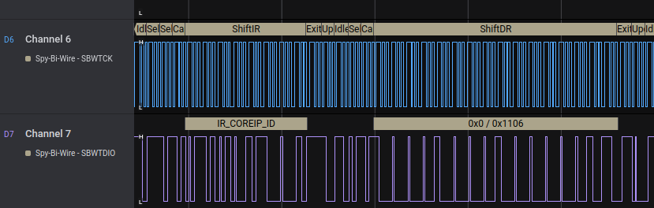
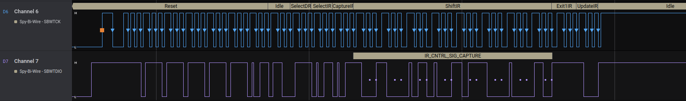
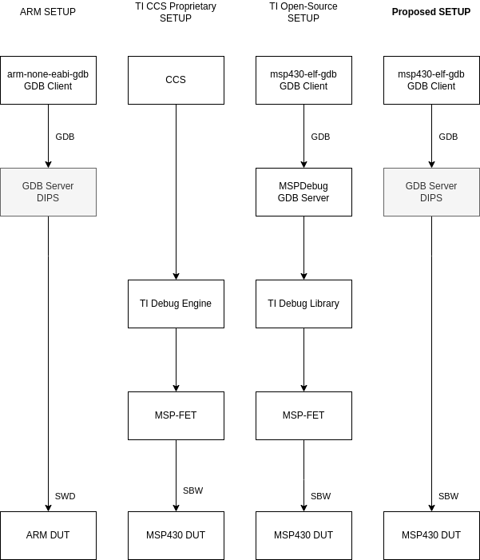

# DIPS Support for MSP430
In this document we outline the current development status of supporting [MSP430 MCUs](https://www.ti.com/microcontrollers-mcus-processors/microcontrollers/msp430-microcontrollers/overview.html) with DIPS. As at the base of DIPS' debugging features is [Black Magic software](https://github.com/blackmagic-debug), where MSP430 support is not provided per default, thus needs to be manually added. DIPS does support the [MSP432 MCU](https://en.wikipedia.org/wiki/TI_MSP432) series (as this is an ARM core), and generic support is provided for Cortex-M0/M3 and M4. Any chip with these ARM cores should be debuggable using DIPS, even though they are not directly supported. Additional features, such as programming, would require device-specific implementation in DIPS/Black Magic as these implementations vary per chip unfortunately.

First, we outline the interface and how the DIPS debugger connects to the MSP430 under test. Second, we further describe the software support.

_Important note_: Since the MSP430 debug feature is under active development, this document will be updated as further support is added.

## Interface
For MSP430 devices the Spy-by-wire (SBW) interface is commonly used within intermittent computing platforms. This is a serialized JTAG interface custom to the Texas Instruments (TI) MSP430 platform reducing the number of required pins during debugging. 

On development boards of the MSP430, such as [MSP-EXP430FR5994](https://www.ti.com/product/MSP430FR5994) and [MSP-EXP430FR5969](https://www.ti.com/product/MSP430FR5969), communication with the onboard debugger occurs through SBW. As this is the most common option for debugging (and intermittent systems are most often bound by space restriction), we chose to support MSP430 through SBW. Using an adapter cable, we can directly connect MSP430 devices to DIPS. The connections of this cable are listed in the figure below. We note that these connections are in addition to a possible connection to the emulator through the emulator output connector on DIPS.

Since DIPS's architecture includes level shifters on the debugger output, SBW signals generated from the debugger are shifted to the voltage sensed on the VCC pin of the MSP430, fulfilling the required signal level constraints. Therefore we do not foresee any issues regarding the hardware capability of DIPS debugging MSP430 since the level shifters of DIPS are capable of 60 Mbps transfer at 1.5 V, far exceeding the connection requirements. The MCU controlling the debugging within DIPS is also far more capable than the chips serving as integrated debuggers in the TI development kits. Hence the timing requirements of DIPS should be met without issue.

## Spy-by-Wire Protocol
TI provides a user's guide for [programming with the JTAG/SBW interface](https://www.ti.com/lit/ug/slau320aj/slau320aj.pdf). Our implementation is based on the protocol description in this document. Please note however that this document does not provide information about setting breakpoints and watchpoints. This unfortunately requires reverse engineering of the open source [debugger code](https://www.ti.com/tool/MSPDS) from TI.

For the record, the figure below (taken from [TI Users guide (Figure 2-10)](https://www.ti.com/lit/ug/slau320aj/slau320aj.pdf)) shows a detailed diagram of how SBW operates.

The traditional JTAG signals TMS, TDI and TDO are multiplexed on a single I/O line. This introduces further timing requirements in order to keep alignment with the MSP430 under test. As of now the SBW communication primitives are implemented and further features are developed, such as CPU control and reading/writing from/to memory.

## DIPS Software Support

| Command | Status |
| ----------- | ----------- |
| Attach/detatch | Yes |
| Register reads/writes | Yes | 
| Reset | Pending | 
| Halt/resume | Yes | 
| Breakpoints | Yes | 
| Watchpoints | Pending | 
| Energy breakpoints | Yes | 
| Energy guards | Yes | 

### Attaching

DIPS queries the JTAG and SWD interfaces to connect with devices under test. When a device responds, the target ID is retrieved together with vendor-specific IDs (when possible) to determine FLASH/RAM sizes etc. Then the correct target driver is loaded.

We extend this interface with another query to find MSP430 devices on the SBW bus. When an MSP430 device responds to the query, the internal commands (e.g. reg read/write/ breakpoints) are switched to custom MSP430 compatible ones, retargeting the debugger from ARM to MSP430. 

Below a screenshot is shown of DIPS attaching to an MSP430 from the console perspective. In addition, some of the underlying SBW queries between DIPS and the MSP430 are shown to fetch the COREID and JTAGID to identify the chip.

## Debugging MSP430 with DIPS

Due to the different instruction set of the MSP430, TI has its own fork of the GCC suite, named MSP430-GCC. TI's development environment for MSP430 is named Code Composer Studio (CCS), an Eclipse-based IDE. Per default this IDE uses TI's proprietary debugging engine connecting to the MSP-FET debugger. When debugging using open source tools, a common method is to use msp430-gdb and a translation library like MSPDebug to act as a GDB server converting gdb client commands to the TI interface that controls the MSP-FET.

We propose a setup similar to the ARM debugging scenario where DIPS directly acts as the GDB Server and then internally converts messages to SBW commands. We note that even in the case of using CCS open-source suite, debugging with GDB can be configured. An overview of these options is shown in the figure below.

