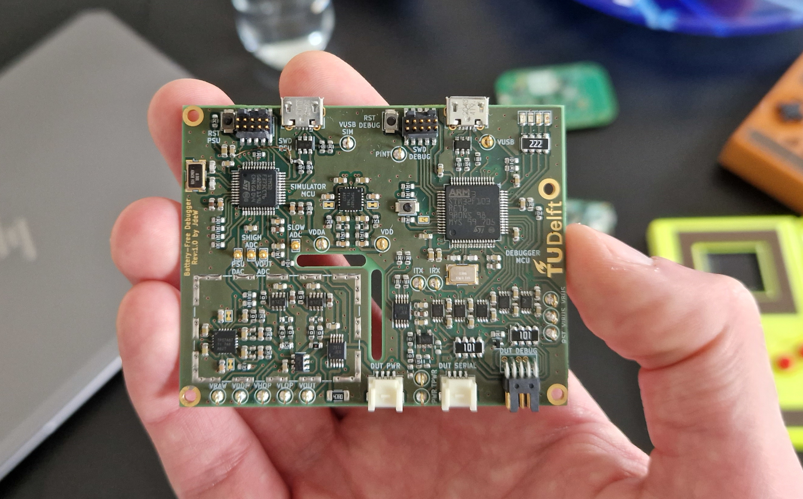
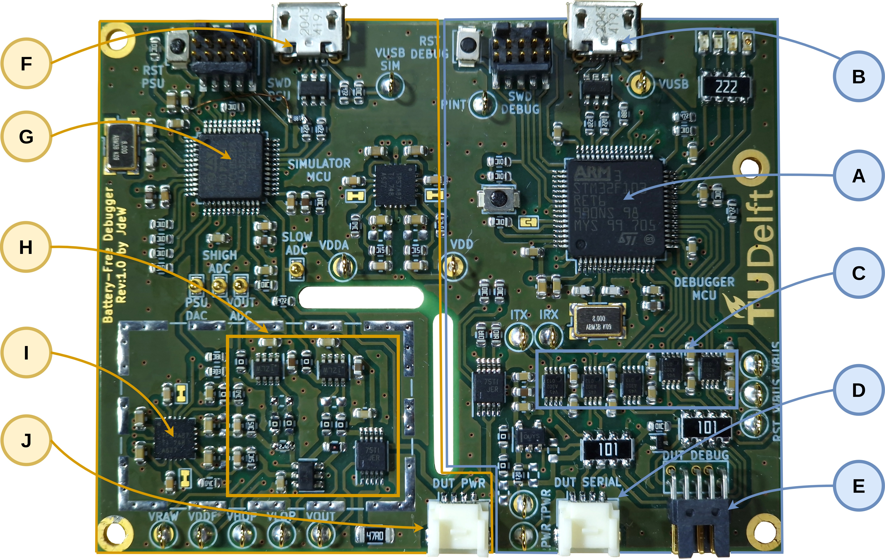

# DIPS


This is the official public repository for **DIPS**: **D**ebugger for **I**ntermittently-**P**owered **S**ystems. The repository consists of all components that make DIPS:
- [Hardware](https://github.com/TUDSSL/DIPS/tree/master/hardware)
- [Debugger Firmware](https://github.com/TUDSSL/DIPS/tree/master/int-debugger-firmware)
- [Emulator Firmware](https://github.com/TUDSSL/DIPS/tree/master/int-debugger-emulator)
- [Emulator Host (GUI)](https://github.com/TUDSSL/DIPS/tree/master/int-debugger-emulator-host)
- [DIPS Console](https://github.com/TUDSSL/DIPS/tree/master/int-debugger-console)

## Project Overview
### Rationale
Intermittently-Powered or Battery-Free systems are low-powered embedded systems that experience frequent power failures. In recent years intermittently-powered systems have been explored excessively by the research community, but there was no good way of debugging these systems. DIPS aims to address this challenge. 

### Debugging Intermittently-Powered Systems
Common debuggers, like the [J-link](https://www.segger.com/products/debug-probes/j-link/), are perfect for debugging continuously-powered systems but will lose connection on a power failure when debugging intermittently-powered systems, making it useless for debugging battery-free systems. On top of that, intermittently-powered systems come with their own set of challenges by introducing new architectures like checkpointing. DIPS allows for continuous debugging despite power failures by reconnecting automatically and restoring the debugging state (Breakpoints) to the device under test. Scripts supplement the functionality of DIPS, allowing for automated tests of memory and peripheral consistency.

### Features:
DIPS integrates a fully featured emulator with close integration with an onboard hardware debugger. It can power devices under test through various modes and features current measurement capability. A key feature is the ability to pause emulation during debugger interaction, such as breakpoints. The emulator supports the following modes:
- Constant Voltage
- Sawtooth
- Square
- Triangle
- Virtual Buck-Boost (Allows for replaying energy harvesting traces to the device under test)
- Passive mode (Only takes over powering the device when prompted during debugging, requires passive debugging mode **mon passive_mode enable**)

The hardware debugger supports, through the associated console application, supports the following features:

- **energy_guards** energy-neutral code sections  where the emulator pauses
- **energy_breakpoints** that only trigger if the voltage is lower than the specified threshold
- **dips_mem_check** memory state consistency verification script, configured in **dips_testing.json**
- **dips_peripheral_check** peripheral state consistency verification script, configured in **dips_testing.json**
- Printing (**DIPS_PRINTF**), asserts (**DIPS_ASSERT**) and manually attaching (**DIPS_ATTACH**) through a simple C interface
- Passive operation (**wait_connect**) where the debugger only connects when prompted through a pin. 

### Hardware



#### Hardware Debugger
The hardware design of the debugger centers around a STM32F103RET MCU (A) and is based on the [Black Magic Debug Probe](https://github.com/blackmagic-debug/blackmagic). It is able to communicate with the energy emulator through SPI. The MCU interfaces with the DUT through SWD/JTAG or SBW (E), I/O interrupt pins and acts as a UART-USB bridge (D). To translate the signals to the DUT voltage, first, the DUT voltage is buffered using a low input bias current buffer amplifier OPA192. Next, all the interfaces with the DUT are level shifted by level translators (C) using the buffered DUT
voltage. The debugger connects to the PC with USB (B). 

#### Energy Emulator 
Central to the energy emulator is the low-noise TPS7A87 (I) linear regulator. The regulator generates the adjustable supply rail to the DUT (J). Power consumption by the DUT is measured by two INA186 current sense amplifiers (H). The first amplifier with a 5.6 Ω sense resistor measures large currents without imposing a high burden voltage. The second amplifier with a 1000 Ω sense resistor measures low currents and is able to be bypassed at large currents preventing high burden voltages. Two analog switches allow for quickly disabling the output and discharging the output through a 47 Ω resistor. The emulator is controlled by a STM32F373 MCU (G). With its on-board DAC DIPS is able to adjust the linear regulator and samples the output voltage and the output of the current sense amplifiers (each using one of its dedicated on-board Sigma Delta ADCs). The energy emulator connects to the PC with USB (F)

#### Design files
In the **hardware** folder both the KICAD design files are provided together with a PDF schematic and gerbers.


## Getting Started
This repository has all information to build your own DIPS. Below we describe building and executing the complete repository of DIPS, including hardware, debugger software, emulator software and both emulator and console applications.

### Building the Debugger Firmware
The hardware debugger firmware is based on the [Black Magic Probe](https://github.com/blackmagic-debug/blackmagic) and can be found in the [/int-debugger-firmware](https://github.com/TUDSSL/DIPS/tree/master/int-debugger-firmware) folder

#### Build Process
After cloning the repository one can compile the firmware in two ways, first is by running it as a [PlatformIO](https://platformio.org/) project or by building it from scratch using the provided cmake files running the following section:

```
$ cd int-debugger-firmware
$ pio run
```

After building, you can upload the firmware to the MCU using your favourite flashing method whilst powering the platform using USB.

#### Last Tested Software Versions
This software was build successfully with these software versions:

- CMake version 3.26.3 
- arm-none-eabi-gcc version 13.1.0 
- arm-none-eabi-newlib version 4.3.0.20230120
- arm-none-eabi-binutils version 2.40 
- PlatformIO version 6.1.7

### The Emulator Firmware
The emulator firmware is located in the [/int-debugger-emulator](https://github.com/TUDSSL/DIPS/tree/master/int-debugger-emulator) folder

#### Build Process
After cloning the repository the emulator can be compiled and build by running the enclosed cmake commands:

```
$ cd int-debugger-emulator
$ mkdir build
$ cd build
$ cmake ..
$ make
```

After building, you can upload the firmware to the MCU using your favourite flashing method whilst powering the platform using USB.

#### Note on the Emulator Firmware
The firmware is based upon the [FreeRTOS](https://www.freertos.org/) framework, allowing real-time switching of tasks required for the emulator.

#### Last Tested Software Versions
This software was build successfully with these software versions:

- CMake version 3.26.3 
- arm-none-eabi-gcc version 13.1.0 
- arm-none-eabi-newlib version 4.3.0.20230120
- arm-none-eabi-binutils version 2.40
- Protobuf version 21.12

### Building the Emulator Host Software
The next part of software runs on the host PC and is used for communicating with the hardware emulator. The sofware can be found in the [/int-debugger-emulator-host](https://github.com/TUDSSL/DIPS/tree/master/int-debugger-emulator-host) folder.

#### Build Process
After cloning the repository the emulator host application can be compiled and build by running the following commands:

```
$ cd int-debugger-emulator-host
$ cmake .
$ make
```

#### Last Tested Software Versions
This software was build successfully with these software versions:

- [QT](https://www.qt.io/) version 5.15.9
- [HighFive](https://github.com/BlueBrain/HighFive) commit 00dad7172c
- Protobuf version 21.12
- HDF5 version 1.14.1


### The DIPS Console Software
The next part of software also runs on the host PC and is used as a GDB wrapper, allowing the added features of DIPS. The sofware can be found in the [/int-debugger-console](https://github.com/TUDSSL/DIPS/tree/master/int-debugger-console) folder.

#### Setup
Since the DIPS console is a python executable, there is no need for compilation. Install the python libraries mentioned in the `requirements.txt` file and you should be good to go.

#### Last Tested Software Versions
This software was build successfully with these software versions:

- Python version 3.11.3
- Python-pyGDBmi version 0.11.0.0
- Python-pyserial version 3.5
- Python-prompt_toolkit version 3.0.38 
- Python-cmsis_svd version 0.4

#### Execute DIPS Console Application
The DIPS console application can be started by calling the `python3 main.py`, if you have an elf-file binary, you can load this by adding this as extra parameter `python3 main.py firmware.elf`. Other GDB parameters and queries from the command line are avaliable as well.

##### Connecting to DIPS
If you have your DIPS connected over USB you can connect to the hardware by running the `connect` command. The console will automatically search for a DIPS serial connection, establish this connection and connect to the attached device under test. Now one can start debugging intermittenlty-powered systems with DIPS, just like debugging regular powered embedded systems. Manual connection to DIPS is also possible by running the following sequence:

```
(gdb) tar ext /dev/ttyACM0
(gdb) mon s
(gdb) attach 1
```

##### Sample session
After connecting to the DIPS and the device under test, regular arm-none-eabi-gdb commands are availble for use:

```
> python3 main.py example.elf
...<GDB Copyright message>
(gdb) connect
Remote debugging using /dev/ttyACM0
Target voltage: 3.00V
Available Targets:
No. Att Driver
 1      STM32F40x M3/M4
Attaching to program: <code_folder>/example.elf, Remote target
0x800007c in main ()
(gdb) load
Loading section .text, size 0x5868 lma 0x8000000
Loading section .data, size 0x9e0 lma 0x8005868
Loading section .rodata, size 0x254 lma 0x8006248
Start address 0x800007c, load size 25756
Transfer rate: 31 KB/sec, 919 bytes/write.
(gdb) b main
(gdb) c
Breakpoint 1 at 0x80000e8: file <code_folder>/main.c, line 20.
(gdb)
```
## How to Cite This Work

The results of this project have been published in a peer-reviewed academic publication (from which all technical figures in this file originate). Details of the publication are as follows.

* **Authors and the project team:** [Jasper de Winkel](https://www.jasperdewinkel.com/), [Tom Hoefnagel](https://www.linkedin.com/in/tobrec), [Boris Blokland](https://www.linkedin.com/in/boris-blokland-2a0b22138/), [Przemysław Pawełczak](https://www.pawelczak.net/)
* **Publication title:** _DIPS: Debug Intermittently-Powered Systems Like Any Embedded System_
* **Pulication venue:** [Proceedings of ACM SenSys 2022](http://sensys.acm.org/2022/)
* [**Link to publication**](https://doi.org/10.1145/3560905.3568543)

To cite this publication please use the following BiBTeX entry.

```
@inproceedings{dewinkel:sensys:2022:dips,
 author = {de Winkel, Jasper and Hoefnagel, Tom and Blokland, Boris and Pawe\l{}czak, Przemys\l{}aw},
 title = {{DIPS}: Debug Intermittently-Powered Systems Like Any Embedded System},
 booktitle = {Proc. SenSys},
 year = {2022},
 address = {Boston, MA, USA},
 date = nov # " 6--9",
 publisher = {ACM},
 url = {https://doi.org/10.1145/3560905.3568543}
}
```

## Acknowledgments

This research project was supported by [Netherlands Organisation for Scientific Research](https://www.nwo.nl/en), partly funded by the [Dutch Ministry of Economic Affairs and Climate Policy](https://www.government.nl/ministries/ministry-of-economic-affairs-and-climate-policy), through [TTW Perspective program ZERO (P15-01)](https://www.nwo.nl/en/researchprogrammes/perspectief/previous-awards/zero-towards-energy-autonomous-systems-iot) within Project P1.

<a href="https://www.tudelft.nl"></a>

## Copyright

Copyright (C) 2022 TU Delft Embedded Systems Group/Sustainable Systems Laboratory.

MIT Licence or otherwise specified. See [license](https://github.com/TUDSSL/ENGAGE/blob/master/LICENSE) file for details.
